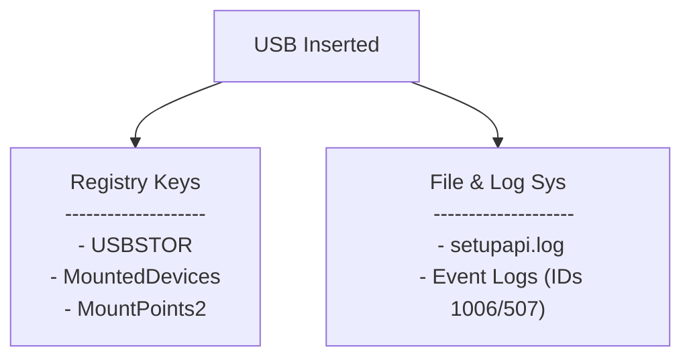

---
layout:
  width: default
  title:
    visible: true
  description:
    visible: false
  tableOfContents:
    visible: true
  outline:
    visible: true
  pagination:
    visible: false
  metadata:
    visible: true
  tags:
    visible: true
  actions:
    visible: true
---

# External Device Connectivity

When establishing a timeline of malicious activity, tracking External Device Connectivity (USB Forensics) is our primary weapon for proving data exfiltration, physical infiltration, and direct human interaction.

No single registry key or file holds all the answers. Instead, we must correlate multiple independent artefacts to build a complete picture of the device's lifecycle.

When an adversary plugs a USB drive into a system, they leave a trail of physical and digital handshakes. Even if they run anti-forensics tools, Windows generates numerous persistent logs to ensure Plug and Play (PnP) devices can be mounted quickly.

For an investigator, these traces allow us to uniquely identify the exact physical device used, determine when it was plugged in, map the assigned drive letter, and tie the action to a specific user account.

<table data-search="true"><thead><tr><th width="152">Artefact Name</th><th width="256">Location</th><th width="220">Forensic Focus</th><th width="117">Time Zone</th></tr></thead><tbody><tr><td>USBSTOR Key</td><td><code>HKLM\SYSTEM\CurrentControlSet\Enum\USBSTOR</code></td><td>Unique hardware identification (VID, PID, Serial)</td><td>UTC</td></tr><tr><td>setupapi.dev.log</td><td><code>C:\Windows\INF\setupapi.dev.log</code></td><td>Exact timestamp of the device's first installation</td><td>Local Time</td></tr><tr><td>MountedDevices</td><td><code>HKLM\SYSTEM\MountedDevices</code></td><td>Mapping the assigned drive letter (e.g. <code>E:</code>)</td><td>UTC (indirect)</td></tr><tr><td>MountPoints2</td><td><code>HKCU\Software\Microsoft\Windows\CurrentVersion\Explorer\MountPoints2</code></td><td>User attribution (proving <em>who</em> mounted the device)</td><td>UTC (LastWrite)</td></tr><tr><td>Partition Diagnostic Log</td><td><code>Microsoft-Windows-Partition%4Diagnostic.evtx</code></td><td>Resilient, timeline-ready insertion and removal events</td><td>UTC</td></tr></tbody></table>
