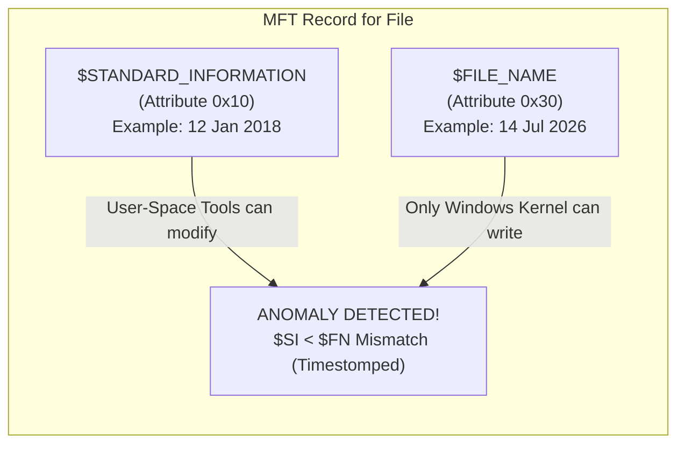

---
layout:
  width: default
  title:
    visible: true
  description:
    visible: false
  tableOfContents:
    visible: true
  outline:
    visible: true
  pagination:
    visible: false
  metadata:
    visible: true
  tags:
    visible: true
  actions:
    visible: true
---

# Timestomping

Timestomping is the practice of modifying a file's cryptographic-grade timestamps (Modified, Accessed, Created, MFT-Modified [mac-b-times.md](../new-technology-file-system-ntfs/master-file-table-mft/mac-b-times.md "mention")) to make a newly introduced malicious file appear to be a legacy Windows operating system binary.

NTFS Master File Table (`$MFT`) record attributes are targeted. NTFS records file timestamps in two separate attributes: `$STANDARD_INFORMATION` (`$SI` or `0x10`) and `$FILE_NAME` (`$FN` or `0x30`).

***

## The $SI <$FN Rule

User-space tools and APIs (such as PowerShell's `Set-ItemProperty` or utilities like `NewFileTime`) can easily modify the timestamps inside the `$STANDARD_INFORMATION` attribute. However, only the Windows OS kernel can write to the `$FILE_NAME` attribute.

Because attackers almost always timestomp files into the past to blend in with legacy files, detecting a file where the `$SI` creation timestamp is older than the `$FN` creation timestamp (`$SI` < `$FN`) is immediate, undeniable proof of timestomping.

Furthermore, manual manipulation often results in subsecond values being completely zeroed out (e.g., ending in `.0000000`).
