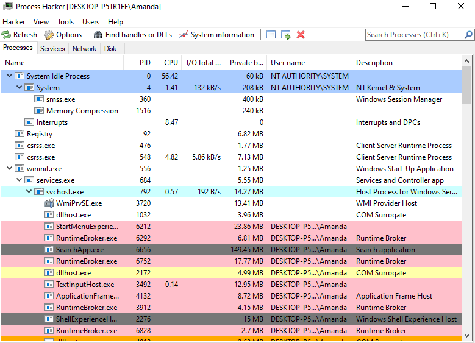

# Process Activities

A large number of process, network, registry and file activities take place within the operating system. Since it may not be possible to analyse all these activities, we can start analysing the activities of the malware processes.

When examining a process, special attention should be paid to information such as whether it creates a new child process, the DLLs it imports, and which user it is run by.

***

## Tools

### Process Hacker

We can use [process-hacker.md](../../../../toolbox/tooling/reverse-engineering/dynamic-analysis/process-hacker.md "mention") to examine processes.

<figure><figcaption></figcaption></figure>
