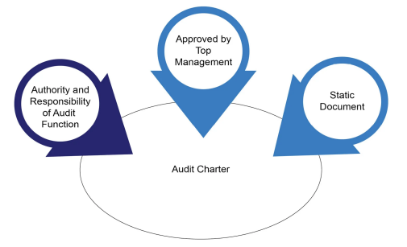

---
layout:
  width: default
  title:
    visible: true
  description:
    visible: false
  tableOfContents:
    visible: true
  outline:
    visible: true
  pagination:
    visible: false
  metadata:
    visible: true
  tags:
    visible: true
---

# Audit Charter

An audit charter is a formal document that outlines the purpose, authority, scope, and objectives of
\
an audit department. The audit plan gives auditors the permission and direction to look at specific parts of a company’s systems and processes.

An auditor’s activities are impacted by the charter of the audit department, and it authorises the accountability and responsibility of the entire audit department. In the absence of an approved charter, the auditee may hardly acknowledge the existence of the audit team.

***

## Features of a Charter

* An audit charter is a formal document defining the internal audit’s objective, authority, and
  \
  responsibility. The audit charter covers the entire scope of audit activities. An audit charter must
  \
  be approved by senior management.

<figure><figcaption>
Features of an audit charter
</figcaption></figure>

* An audit charter should not be changed too often as it defines the objective of the audit function,
  \
  and hence procedural aspects should not be included. Frequent changes in the audit charter
  \
  can create confusion and lack of clarity about the audit function’s role and responsibilities. This
  \
  instability can reduce the audit team’s effectiveness.
* Also, it is recommended to not include a detailed annual audit calendar, including things such
  \
  as planning, resource allocation, and other details, such as audit fees and expenses. As the
  \
  charter requires the approval of the board/senior management, it is advisable to not include
  \
  details that require frequent adjustment.
* An audit charter should be reviewed at a minimum annually to ensure that it is aligned with
  \
  business objectives.

***

## Contents of a Charter

An audit charter includes the following:

* The mission, purpose, and objective of the audit function
* The scope of the audit function
* The responsibilities of management
* The responsibilities of internal auditors
* The authorised personnel of the internal audit work

If an audit is outsourced to an audit firm, the objective of the audit, along with its detailed scope, should be incorporated in an audit engagement letter. The purpose of the engagement letter is to clearly
&#x20;outline the scope, objectives, responsibilities, and expectations of the audit firms.
