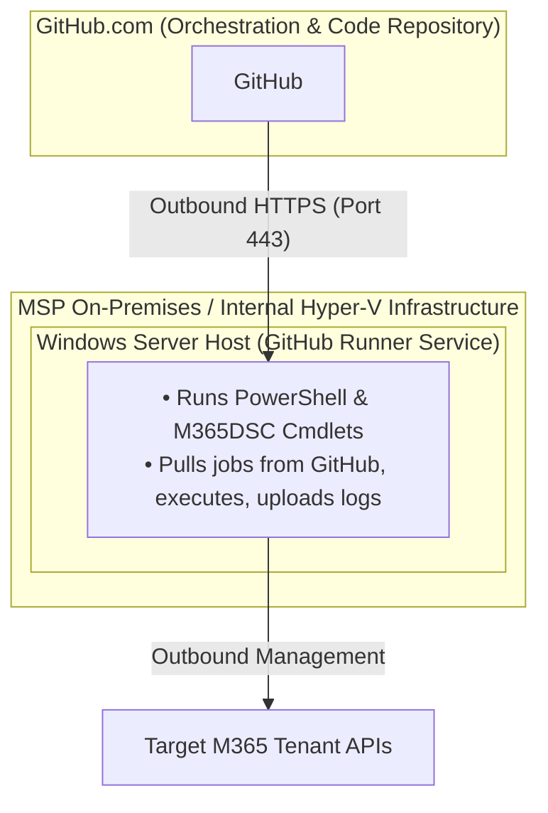

---
layout:
  width: default
  title:
    visible: true
  description:
    visible: false
  tableOfContents:
    visible: true
  outline:
    visible: true
  pagination:
    visible: false
  metadata:
    visible: true
  tags:
    visible: true
  actions:
    visible: true
---

# Microsoft365DSC


#### Official Website

[https://microsoft365dsc.com/](https://microsoft365dsc.com/)


Microsoft365DSC (Microsoft 365 Desired State Configuration) is an open-source PowerShell module backed by Microsoft engineers and the community. It allows IT professionals to define, deploy, monitor, and document the configuration of Microsoft 365 workloads using code.

Unlike traditional administration - which relies on manually clicking through admin portals like Entra ID, Exchange Online, SharePoint, Teams, and Security & Compliance centers - Microsoft365DSC uses a declarative engine. Instead of scripting a series of step-by-step actions (_"go to Teams portal, change setting X to false"_), engineers define the final state required of the tenant (_"Teams setting X must equal false"_).

**Key Capabilities:**

* **Configuration Export:** Extract existing settings from a live M365 tenant into readable code scripts.
* **Drift Detection & Reporting:** Periodically compare a live tenant's state against the approved configuration to catch unauthorised changes.
* **Tenant Replication / Cloning:** Apply a baseline configuration across multiple tenants or sync settings between staging and production environments.
* **Automated Documentation:** Generate HTML or Excel reports directly from your configuration code.

***

## Configuration as Code (CaC)

Configuration-as-Code (CaC) is the practice of managing system configurations (like M365 security rules, sharing policies, and license assignments) using version-controlled text files, in the same way software developers manage source code.

**Why CaC is Essential for Cloud Governance**

1. **Elimination of Human Error:** Manual administration through web consoles inherently leads to missed settings, inconsistent setups, and human oversight.
2. **Version Control & Auditability:** By storing configuration files in a Git repository (e.g., GitHub or Azure DevOps), every change is tracked. You know exactly who made a change, when it was made, and why (via pull request comments).
3. **Peer Review & Approval:** Changes must pass peer code reviews before being merged into the master branch and deployed to production tenants.
4. **Instant Disaster Recovery:** If a tenant configuration is corrupted or modified erroneously, you can re-apply your verified code file within minutes to restore the exact desired state.
5. **Consistency at Scale:** For Managed Service Providers (MSPs) managing dozens or hundreds of tenants, CaC ensures a single security baseline can be reliably enforced across the entire client base.

***

## Best Practices

To run Microsoft365DSC safely and efficiently, adhere to the following core operational principles:

* **Never Deploy Directly from Personal Devices:** Engineer workstations lack continuous execution, invite security risks by storing client credentials locally, and suffer from module version drift. Use automated CI/CD pipelines instead.
* **Adopt Non-Interactive Certificate Authentication:** Avoid using Global Administrator user credentials in automation scripts. Authenticate via Service Principals (App Registrations) using self-signed or enterprise certificates.
* **Enforce Least-Privilege Permissions:** Restrict the App Registration's Graph API / Exchange permissions strictly to the workloads being managed rather than assigning blanket global rights.
* **Start in Alert-Only Mode (Drift Detection):** When introducing M365DSC to an existing tenant, configure your workflow to detect and alert on configuration drift first. Only enable automatic remediation once you have validated that your code covers all legitimate operational exceptions.
* **Separate Baselines from Environment Data:** Keep your core resource definitions (e.g., standard anti-phishing policies) separate from environment-specific variables (e.g., domain names, tenant IDs) using `.psd1` Configuration Data files.

***

## Core Setup

Setting up M365DSC for headless, automated execution in a CI/CD pipeline requires establishing non-interactive authentication.

### Step 1: Create an Entra ID App Registration

1. Log into the Microsoft Entra admin center for the target tenant.
2. Navigate to 'Identity > Applications > App registrations' and click 'New registration'.
3. Name the application (e.g., `M365DSC-Automation-App`) and set the supported account type to 'Single tenant'.
4. Assign the necessary API Permissions (Application level, not Delegated) for the workloads you plan to manage (e.g., Microsoft Graph `Directory.ReadWrite.All`, `Policy.Read.All`).
5. Grant Admin Consent for the configured permissions.

### Step 2: Generate and Upload an Authentication Certificate

In an elevated PowerShell prompt on a secure management machine, generate a self-signed certificate:

```powershell
# Generate the self-signed certificate
$cert = New-SelfSignedCertificate `
    -Subject "CN=M365DSC-Auth" `
    -CertStoreLocation "Cert:\CurrentUser\My" `
    -KeyExportPolicy Exportable `
    -KeySpec Signature `
    -KeyLength 2048 `
    -KeyAlgorithm RSA `
    -HashAlgorithm SHA256

# Export the public key (.cer) to upload to Entra ID
Export-Certificate -Cert $cert -FilePath "C:\Certs\M365DSC-Auth.cer"

# Export the private key (.pfx) to store in your pipeline key vault
$password = ConvertTo-SecureString -String "YourSecurePassword123!" -Force -AsPlainText
Export-PfxCertificate -Cert $cert -FilePath "C:\Certs\M365DSC-Auth.pfx" -Password $password
```

1. Return to your App Registration in Entra ID.
2. Go to Certificates & secrets > Certificates > Upload certificate, and upload `M365DSC-Auth.cer`.
3. Note down the Application (Client) ID, Directory (Tenant) ID, and the Certificate Thumbprint.

### Step 3: Convert the `.pfx` Certificate to Base64

GitHub Secrets only accept plain text strings, not binary files like `.pfx`. We need to convert the certificate into a Base64 encoded string first.

Open PowerShell on the machine where the certificate was created and run:


```powershell
# Path to your exported .pfx certificate
$pfxPath = "C:\Certs\M365DSC-Auth.pfx"

# Convert the binary file to a Base64 text string
$base64Content = [Convert]::ToBase64String([System.IO.File]::ReadAllBytes($pfxPath))

# Copy the Base64 string directly to your clipboard
$base64Content | Set-Clipboard

Write-Host "Certificate converted and copied to clipboard!" -ForegroundColor Green
```


### Step 4: Choose Where to Store the Secrets in GitHub

We have two choices depending on your architecture:

* **Option A:** Repository Secrets (Simplest - Single Tenant): Available to all workflows in the repository.
* **Option B:** Environment Secrets (Recommended for MSPs / Multi-Tenant): Isolated per environment (e.g., `Client-Alpha`, `Client-Beta`), allowing us to reuse the same variable names for different tenants.

### Step 5: Configure CI/CD Secrets

Do not hardcode keys or thumbprints into the public or private code repositories. Store them as repository or environment secrets:

* `M365_TENANT_ID`: The Directory ID of the target tenant.
* `M365_CLIENT_ID`: The Application ID of the App Registration.
* `M365_CERT_THUMBPRINT`: The certificate thumbprint.
* `M365_CERT_BASE64`: The contents of the `.pfx` file converted to a Base64 string for dynamic loading into transient pipeline runners.


#### Important Security Rules

* **Once saved, secrets cannot be viewed:** GitHub never shows the string value again after saving. You can only update or overwrite it.
* **Log Masking:** GitHub Actions automatically detects and redacts these secret values from the execution logs, replacing them with `***`.
* **Branch Protection:** For production environments, enable Branch Protection Rules on `main` to require a Pull Request review before anyone can trigger a pipeline that utilizes these secrets.


***

## Utilising Stored Secrets

Once secrets are securely stored in GitHub (either as Repository Secrets or Environment Secrets), they must be injected into the workflow runner at runtime.

Because GitHub Actions runners start as completely clean, ephemeral virtual machines, the pipeline must dynamically extract these secrets to reconstruct the authentication certificate and authenticate against the Microsoft Graph and Exchange Online APIs.

### Accessing Secrets in YAML Syntax

GitHub Actions exposes secrets through the `${{ secrets.SECRET_NAME }}` context object. We pass these values into PowerShell steps via workflow environment variables or direct command arguments.


```yaml
env:
  TENANT_ID: ${{ secrets.M365_TENANT_ID }}
  CLIENT_ID: ${{ secrets.M365_CLIENT_ID }}
  CERT_THUMBPRINT: ${{ secrets.M365_CERT_THUMBPRINT }}
  CERT_BASE64: ${{ secrets.M365_CERT_BASE64 }}
  CERT_PASSWORD: ${{ secrets.M365_CERT_PASSWORD }}
```



#### Security note

GitHub automatically redacts secret values in step outputs and execution logs, masking them as `***`.


### Step 1: Reconstructing the Certificate in Memory

The runner reads the `M365_CERT_BASE64` text secret, decodes it back into binary byte data, and installs it into the local user's Windows Certificate Store (`Cert:\CurrentUser\My`).


```yaml
- name: Reconstruct and Import Certificate
  shell: powershell
  env:
    CERT_BASE64: ${{ secrets.M365_CERT_BASE64 }}
    CERT_PASSWORD: ${{ secrets.M365_CERT_PASSWORD }}
  run: |
    # 1. Convert the Base64 text string back to raw certificate bytes
    $certBytes = [System.Convert]::FromBase64String($env:CERT_BASE64)
    
    # 2. Instantiate the X509Certificate2 object in memory
    $cert = New-Object System.Security.Cryptography.X509Certificates.X509Certificate2(
        $certBytes, 
        $env:CERT_PASSWORD, 
        [System.Security.Cryptography.X509Certificates.X509KeyStorageFlags]::Exportable
    )
    
    # 3. Add the certificate to the temporary runner's store
    $store = Get-Item "Cert:\CurrentUser\My"
    $store.Open([System.Security.Cryptography.X509Certificates.OpenFlags]::ReadWrite)
    $store.Add($cert)
    $store.Close()
    
    Write-Host "Authentication certificate installed successfully."
```


### Step 2: Passing Parameters to Compile the Configuration

Once the certificate resides in the local store, pass the `M365_CLIENT_ID`, `M365_TENANT_ID`, and `M365_CERT_THUMBPRINT` secret's directly into your M365DSC compilation script:


```yaml
- name: Compile M365DSC Configuration
  shell: powershell
  run: |
    # Dot-source your DSC configuration script
    . .\Baselines\M365SecurityBase.ps1

    # Execute the configuration function with secret arguments
    M365SecurityBase `
      -ApplicationId "${{ secrets.M365_CLIENT_ID }}" `
      -TenantId "${{ secrets.M365_TENANT_ID }}" `
      -CertificateThumbprint "${{ secrets.M365_CERT_THUMBPRINT }}"
```


### Step 3: Authenticating Against Microsoft 365

During execution, `Start-DscConfiguration` matches the `-CertificateThumbprint` against the installed certificate to sign the OAuth 2.0 token request sent to Entra ID (`[https://login.microsoftonline.com/](https://login.microsoftonline.com/)<TenantID>/oauth2/v2.0/token`).


```yaml
- name: Apply Configuration to Tenant
  shell: powershell
  run: |
    # Start-DscConfiguration consumes the compiled .mof file
    # Authentication occurs automatically using the matched thumbprint and App Registration
    Start-DscConfiguration -Path .\M365SecurityBase -Wait -Verbose -Force
```


### Handling Multi-Tenant Environment Secrets

If configured for multiple client tenants within a single monorepo, assign secrets to specific GitHub Environments rather than repository root secrets.

In the workflow, add the `environment` property to tell GitHub which client credentials to pull dynamically:


```yaml
jobs:
  deploy-client-alpha:
    runs-on: windows-latest
    # Pulls M365_CLIENT_ID, M365_TENANT_ID, etc., specifically from the 'Client-Alpha' environment
    environment: Client-Alpha

    steps:
      - name: Checkout Code
        uses: actions/checkout@v4

      - name: Run M365DSC
        shell: powershell
        run: |
          # The secrets context automatically evaluates to Client-Alpha's credentials
          Write-Host "Targeting Tenant ID: ${{ secrets.M365_TENANT_ID }}"
```


***

## Automating Workflows via GitHub Actions

By using GitHub Actions as an orchestration engine, you transform manual PowerShell operations into repeatable, automated cloud tasks. The pipeline executes operations like drift detection, configuration exports, and report generation in transient, secure virtual machines.

### Workflow 1: Continuous Drift Detection & Auto-Remediation

This workflow runs on a nightly schedule (`cron`) to verify whether the target tenant matches your source code. If drift is detected, the pipeline fails and sends an alert. You can optionally uncomment the auto-remediation step to automatically overwrite unauthorized portal modifications.

Create `.github/workflows/drift-detection.yml`:

```yaml
name: M365DSC Drift Detection

on:
  schedule:
    # Runs automatically every night at 02:00 UTC
    - cron: '0 2 * * *'
  workflow_dispatch: # Allows manual triggers from the GitHub Actions UI

jobs:
  assess-tenant:
    runs-on: windows-latest
    environment: Production-Tenant

    steps:
      - name: Checkout Configuration Code
        uses: actions/checkout@v4

      - name: Install Microsoft365DSC & Dependencies
        shell: powershell
        run: |
          Set-ExecutionPolicy Unrestricted -Scope Process -Force
          Install-Module -Name Microsoft365DSC -Force -AllowClobber -Scope CurrentUser
          Update-M365DSCDependencies

      - name: Import Authentication Certificate
        shell: powershell
        env:
          CERT_BASE64: ${{ secrets.M365_CERT_BASE64 }}
          CERT_PASSWORD: ${{ secrets.M365_CERT_PASSWORD }}
        run: |
          $certBytes = [System.Convert]::FromBase64String($env:CERT_BASE64)
          $cert = New-Object System.Security.Cryptography.X509Certificates.X509Certificate2(
              $certBytes, 
              $env:CERT_PASSWORD, 
              [System.Security.Cryptography.X509Certificates.X509KeyStorageFlags]::Exportable
          )
          $store = Get-Item "Cert:\CurrentUser\My"
          $store.Open([System.Security.Cryptography.X509Certificates.OpenFlags]::ReadWrite)
          $store.Add($cert)
          $store.Close()

      - name: Compile DSC Configuration
        shell: powershell
        run: |
          . .\Baselines\M365SecurityBase.ps1
          M365SecurityBase `
            -ApplicationId "${{ secrets.M365_CLIENT_ID }}" `
            -TenantId "${{ secrets.M365_TENANT_ID }}" `
            -CertificateThumbprint "${{ secrets.M365_CERT_THUMBPRINT }}"

      - name: Test Tenant for Configuration Drift
        shell: powershell
        run: |
          $driftResult = Test-DscConfiguration -Path .\M365SecurityBase -Detailed
          if ($driftResult.InDesiredState -eq $false) {
              Write-Error "CRITICAL: Configuration drift detected in M365 Tenant!"
              $driftResult.ResourcesNotInDesiredState | Format-Table -Autosize
              
              # OPTIONAL: Uncomment to force auto-remediation
              # Start-DscConfiguration -Path .\M365SecurityBase -Wait -Force
              
              exit 1
          } else {
              Write-Host "SUCCESS: Tenant is fully compliant with desired state code."
          }
```

### Workflow 2: Automated Tenant Export & Automated Documentation

Rather than logging in manually, this workflow extracts the live tenant setup, compiles an HTML/Excel documentation report using `New-M365DSCReportFromConfiguration`, and automatically opens a Pull Request if settings have changed.

Create `.github/workflows/export-and-document.yml`

```yaml
name: M365DSC Automated Export & Documentation

on:
  workflow_dispatch: # Triggered manually by engineers on-demand

jobs:
  export-and-report:
    runs-on: windows-latest
    environment: Production-Tenant

    steps:
      - name: Checkout Code
        uses: actions/checkout@v4

      - name: Install M365DSC
        shell: powershell
        run: |
          Set-ExecutionPolicy Unrestricted -Scope Process -Force
          Install-Module -Name Microsoft365DSC -Force -AllowClobber -Scope CurrentUser

      - name: Import Certificate
        shell: powershell
        env:
          CERT_BASE64: ${{ secrets.M365_CERT_BASE64 }}
          CERT_PASSWORD: ${{ secrets.M365_CERT_PASSWORD }}
        run: |
          $certBytes = [System.Convert]::FromBase64String($env:CERT_BASE64)
          $cert = New-Object System.Security.Cryptography.X509Certificates.X509Certificate2($certBytes, $env:CERT_PASSWORD, [System.Security.Cryptography.X509Certificates.X509KeyStorageFlags]::Exportable)
          $store = Get-Item "Cert:\CurrentUser\My"
          $store.Open([System.Security.Cryptography.X509Certificates.OpenFlags]::ReadWrite)
          $store.Add($cert); $store.Close()

      - name: Export Live Configuration
        shell: powershell
        run: |
          Export-M365DSCConfiguration `
            -ApplicationId "${{ secrets.M365_CLIENT_ID }}" `
            -TenantId "${{ secrets.M365_TENANT_ID }}" `
            -CertificateThumbprint "${{ secrets.M365_CERT_THUMBPRINT }}" `
            -Path ".\Exports\LatestExport.ps1"

      - name: Generate HTML & Excel Documentation
        shell: powershell
        run: |
          # Uses M365DSC report generation cmdlets
          New-M365DSCReportFromConfiguration -Type 'HTML' -ConfigurationPath ".\Exports\LatestExport.ps1" -OutputPath ".\Docs\TenantReport.html"
          New-M365DSCReportFromConfiguration -Type 'Excel' -ConfigurationPath ".\Exports\LatestExport.ps1" -OutputPath ".\Docs\TenantReport.xlsx"

      - name: Create Pull Request with Updated Code & Reports
        uses: peter-evans/create-pull-request@v6
        with:
          commit-message: "chore: automated tenant export and documentation update"
          title: "Automated M365 Tenant Export & Updated Documentation"
          body: "This PR contains the latest exported configuration code and newly compiled HTML/Excel documentation reports."
          branch: "automated-export-update"
```

***

## Monorepo vs. Multi-Repository Architectures

When managing multiple environments or client tenants (especially within an MSP structure), choosing the correct repository layout is critical.

```
Monorepo Structure (Recommended for MSPs):
├── .github/workflows/deploy.yml
├── Baselines/
│   └── M365SecurityBase.ps1
└── Clients/
    ├── ClientA/ClientA.psd1
    └── ClientB/ClientB.psd1
```

### Monorepo (Single Repository)

All client configurations and shared baselines live in one central Git repository, organized into distinct subfolders.

| Pros                                                                                                                                                                              | Cons                                                                                                                                                                     |
| --------------------------------------------------------------------------------------------------------------------------------------------------------------------------------- | ------------------------------------------------------------------------------------------------------------------------------------------------------------------------ |
| <p>• Updates to core security baselines can be pushed to all tenants simultaneously.</p><p>• Single pane of glass for all code.</p><p>• Easy maintenance of common workflows.</p> | <p>• Requires strict branch protection policies to prevent accidental cross-tenant changes.</p><p>• Complex permissions if client third parties require code access.</p> |

**Best for:** Internal IT managing multiple brands/subsidiaries, or MSPs managing fully outsourced tenants.

### _Multi-Repository (1 Repo per Tenant)_

Every tenant or client receives a dedicated, isolated Git repository containing its own pipeline files and configurations.

| Pros                                                                                                                                                             | Cons                                                                                                                                                                   |
| ---------------------------------------------------------------------------------------------------------------------------------------------------------------- | ---------------------------------------------------------------------------------------------------------------------------------------------------------------------- |
| <p>• Complete isolation between clients.</p><p>• Easy to grant co-managed client IT teams access to their specific repo.</p><p>• Simple, localized rollback.</p> | <p>• Updating a baseline setting across 50 clients requires modifying 50 individual repositories.</p><p>• High administrative overhead as the tenant count scales.</p> |

**Best for:** Co-managed IT environments where external teams require direct, exclusive access to their configuration source code.

***

## Controlling Usage Costs

Because Microsoft365DSC relies on compiling PowerShell MOF files and running extensive API calls across Microsoft 365, inefficient workflow design can lead to high compute costs or consumed pipeline build minutes.

**1. Leverage Path-Filtering Triggers (GitHub Actions / Azure Pipelines)**

Configure your CI/CD workflows to run only when changes are committed to a specific client folder, rather than running a full multi-tenant deployment on every single code commit:

```yaml
on:
  push:
    paths:
      - 'Clients/ClientA/**'  # Pipeline triggers ONLY if files in ClientA change
```

**2. Implement Batching & Scheduled Staggering**

Avoid running drift detection across 50+ tenants simultaneously.

* Group tenants into regional or operational batches (e.g., 10 tenants per batch).
* Schedule drift detection jobs across off-peak hours using cron triggers (e.g., Batch 1 at 01:00 UTC, Batch 2 at 03:00 UTC) to remain within free runner minute allocations and prevent API rate-limiting/throttling from Microsoft.

**3. Stay Within Cloud Free Tiers (or Use Self-Hosted Runners)**

* **GitHub Actions Free Tier:** Includes 2,000 Linux-equivalent build minutes per month (equivalent to 1,000 Windows runner minutes). Enforce spending limits ($0) to ensure pipeline runs never trigger unexpected charges.
* **Self-Hosted Runners:** If managing a high volume of tenants where monthly cloud runner minutes are exhausted, install the lightweight runner agent on an existing internal Windows VM or hypervisor host. Compute costs drop to £0, as execution moves entirely to internal infrastructure while keeping GitHub as the orchestration interface.

***

## Setting Up Self-Hosted Runners

When managing multiple client tenants or running frequent drift checks, GitHub-hosted Windows runners can consume your monthly free quota. By installing a Self-Hosted Runner on a spare local Windows virtual machine or on-premises server, the compute runs internally on your own infrastructure - reducing your pipeline execution costs to £0.



### Operational & Security Advantages

* **Zero Public Inbound Ports:** The runner service uses long-polling outbound HTTPS (Port 443) to GitHub. You do not need to open firewalls or expose internal networks to inbound internet traffic.
* **Local Certificate Store:** You can store authentication certificates permanently in the local machine's Windows Certificate Store rather than passing Base64 strings through pipeline secrets.
* **Pre-installed Modules:** PowerShell modules like `Microsoft365DSC` can be kept updated locally, reducing pipeline job setup times from 5 minutes down to seconds.

### Configuration

**Step 1: Provision the Host VM**

1. Provision a lightweight Windows Server (2019/2022/2025) or Windows 10/11 Pro VM with a minimum of 2 vCPUs and 4GB RAM.
2.  Install PowerShell 5.1/7.x and pre-stage the required modules:

    ```powershell
    Set-ExecutionPolicy Unrestricted -Scope Process -Force
    Install-Module -Name Microsoft365DSC -Force -AllowClobber -Scope AllUsers
    Update-M365DSCDependencies
    ```

**Step 2: Register the Runner with GitHub**

1. In your GitHub Monorepo, navigate to Settings > Actions > Runners.
2. Click New self-hosted runner and select Windows.
3. Open an elevated PowerShell prompt on your host machine and execute the downloaded registration commands:

```powershell
# Create a dedicated runner directory
New-Item -Path "C:\actions-runner" -ItemType Directory; Set-Location "C:\actions-runner"

# Download the runner package (URL provided in GitHub UI)
Invoke-WebRequest -Uri https://github.com/actions/runner/releases/download/v2.311.0/actions-runner-win-x64-2.311.0.zip -OutFile runner.zip
Expand-Archive -Path .\runner.zip -DestinationPath . ; Remove-Item .\runner.zip

# Configure the connection (Token generated dynamically in GitHub UI)
.\config.cmd --url https://github.com/YourMSP/m365-tenant-configs --token YOUR_DYNAMIC_GITHUB_TOKEN
```

**Step 3: Install as a Persistent Windows Service**

When prompted during `.\config.cmd`, or by running the command manually, install the runner as a background system service so it automatically resumes operation following system reboots:

```powershell
# Installs and starts the GitHub Runner Windows Service
.\env.sh
.\run.cmd --install
Start-Service "actions.runner.YourMSP-m365-tenant-configs.YOUR_HOST_NAME"
```

**Step 4: Targeting the Self-Hosted Runner in Workflows**

To direct your GitHub Actions to process jobs on your internal infrastructure, update the `runs-on` property inside your YAML workflow files from `runs-on: windows-latest` to `runs-on: self-hosted`:

```yaml
jobs:
  deploy:
    # Routes job execution to your local on-premises Windows server
    runs-on: self-hosted 
    steps:
      - name: Checkout Code
        uses: actions/checkout@v4
      
      - name: Run M365DSC Deployment
        shell: powershell
        run: |
          Start-DscConfiguration -Path .\M365SecurityBase -Wait -Verbose -Force
```

***

## Useful IDE Support

If the configurations are modified using Visual Studio Code, install the official PowerShell Extension.

* **IntelliSense / Auto-Complete:** When typing inside a `Node` block in your `.ps1` file, press `Ctrl + Space`. VS Code will display a dropdown list of all available M365DSC resources and valid property names.
* **Syntax Validation:** If you misspell a parameter name or pass a string into a field that expects a boolean (`$true`/`$false`), VS Code will highlight the error in red before you even commit your code to GitHub.
